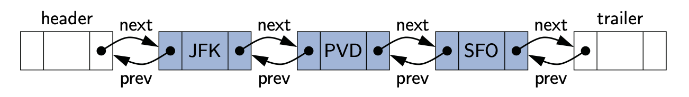
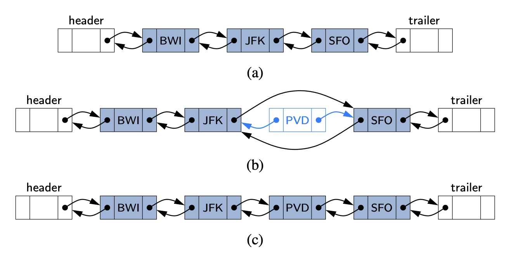
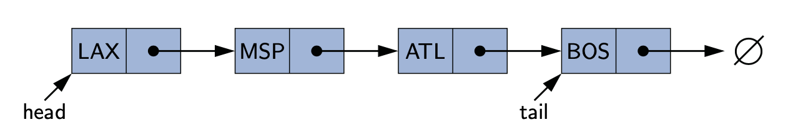
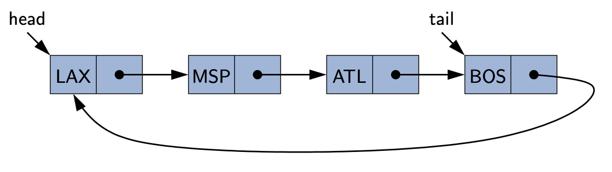

# Contents

- [Linked List](#linked-list)
- [Doubly Linked List](#doubly-linked-list) 
- [Singly Linked List](#singly-linked-list) 
- [Circularly Linked List](#circularly-linked-list)

# Linked List

A linked list, in its simplest form, is a collection of **nodes** that collectively form a linear sequence.

Minimally, the linked list instance must keep a reference to the first node of the list,
known as the **head**. Without an explicit reference to the head, there would be no way to locate that
node (or indirectly, any others). The last node of the list is known as the **tail**. The tail of a list
can be found by traversing the linked list— starting at the head and moving from one node to another
by following each node’s next reference.

## Implementation
Implementation takes advantage of Java’s support for nested classes, as we define a private Node
class within the scope of the public LinkedList class.  Having Node as a nested class provides
strong encapsulation, shielding users of our class from the underlying details about nodes and links.
This design also allows Java to differentiate this node type from forms of nodes we may define for
use in other structures.

# Doubly Linked List



**Header and Trailer Sentinels**

In order to avoid some special cases when operating near the boundaries of a doubly linked list, 
it helps to add special nodes at both ends of the list: a header node at the beginning of the list, 
and a trailer node at the end of the list. These “dummy” nodes are known as sentinels (or guards), 
and they do not store elements of the primary sequence. The header and trailer nodes never change—only
the nodes between them change.

## Insertion
Every insertion into our doubly linked list representation will take place between a pair of existing
nodes. For example, when a new element is inserted at the front of the sequence, we will simply add 
the new node between the header and the node that is currently after the header.



## Removal
The deletion of a node, proceeds in the opposite fashion of an insertion. The two neighbors of the node
to be deleted are linked directly to each other, thereby bypassing the original node. As a result, 
that node will no longer be considered part of the list and it can be reclaimed by the system.

##Traverse

## Implementation
| methods | description |
| --- | --- |
| ```size():``` | Returns the number of elements in the list. |
| ```isEmpty():``` | Returns true if the list is empty, and false otherwise. |
| ```first(): ``` | Returns(but does not remove) the first element in the list. |
| ```last():``` | Returns (but does not remove) the last element in the list. |
| ```addFirst(e):``` | Adds a new element to the front of the list. |
| ```addLast(e):``` | Adds a new element to the end of the list. |
| ```removeFirst():``` | Removes and returns the first element of the list. |
| ```removeLast():``` | Removes and returns the last element of the list. |

[Java class](../../src/main/java/am/studygarage/datastructures/linkedlist/DoublyLinkedList.java)

# Singly Linked List



In a singly linked list, each node stores a reference to an object that is an element of the sequence, as well as a reference to the next node of the list.

supports the following methods:

### Implementation

| methods | description |
| --- | --- |
| ```size():``` | Returns the number of elements in the list. |
| ```isEmpty():``` | Returns true if the list is empty, and false otherwise. |
| ```first(): ``` | Returns(but does not remove) the first element in the list. |
| ```last():``` | Returns (but does not remove) the last element in the list. |
| ```addFirst(e):``` | Adds a new element to the front of the list. |
| ```addLast(e):``` | Adds a new element to the end of the list. |
| ```removeFirst():``` | Removes and returns the first element of the list. |

[Java class](../../src/main/java/am/studygarage/datastructures/linkedlist/SinglyLinkedList.java)

# Circularly Linked List



Linked lists are traditionally viewed as storing a sequence of items in a linear order, from first 
to last. However, there are many applications in which data can be more naturally viewed as having a
cyclic order, with well-defined neighboring relationships, but no fixed beginning or end.
For example, many multiplayer games are turn-based, with a player A taking a turn, then player B, 
then player C, and so on, but eventually back to player A again, and player B again, with the 
pattern repeating. As another example, city buses and subways often run on a continuous loop, 
making stops in a scheduled order, but with no designated first or last stop per se. We next consider
another important example of a cyclic order in the context of computer operating systems. 
Or Round-Robin scheduling and Round-Robin item allocation.

## Additional Optimization
In implementing a new class, we make one additional optimization—we no longer explicitly maintain the
head reference. So long as we maintain a reference to the tail, we can locate the head as tail.getNext(). 
Maintaining only the tail reference not only saves a bit on memory usage, it makes the code simpler 
and more efficient, as it removes the need to perform additional operations to keep a head reference current. 
In fact, our new implementation is arguably superior to our original singly linked list implementation, 
even if we are not interested in the new rotate method.

### Rotation
Implementing the new rotate method is quite trivial. We do not move any nodes or elements, 
we simply advance the tail reference to point to the node that follows it (the implicit head of the list).
{ LAX, MSP, ATL, BOS } -> { MSP, ATL, BOS, LAX }

### Insertion
We can add a new element at the front of the list by creating a new node and linking it just after 
the tail of the list. To implement the addLast method, we can rely on the use of a call to addFirst 
and then immediately advance the tail reference so that the newest node becomes the last.

###Removal
Removing the first node from a circularly linked list can be accomplished by simply updating the next field of the tail node to bypass the implicit head. A Java implementation of all methods of the CircularlyLinkedList class.

### Implementation

| methods | description |
| --- | --- |
| ```size()``` | Returns the number of elements in the list. |
| ```isEmpty()``` | Returns true if the list is empty, and false otherwise. |
| ```first()``` | Returns(but does not remove) the first element in the list. |
| ```last()``` | Returns (but does not remove) the last element in the list. |
| ```rotate()``` | Rotate the first element to the back of the list, the old head becomes the new tail |
| ```addFirst(e)``` | Adds a new element to the front of the list. |
| ```addLast(e)``` | Adds a new element to the end of the list. |
| ```removeFirst()``` | Removes and returns the first element of the list. |

[Java class](../../src/main/java/am/studygarage/datastructures/linkedlist/CircularlyLinkedList.java)
      
           
            
       
    
     
  


         
      
       
         
    
     
  
