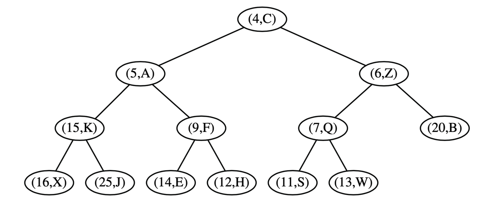

# Contents

# Priority Queue

Priority Queue is a collection of prioritized elements that allows arbitrary element insertion, and allows the removal
of the element that has first priority. When an element is added to a priority queue, the user designates its priority
by providing an associated key. The element with the minimal key will be the next to be removed from the queue.

_Note:_ Implementation and interface provided in this document and related implementation are designed with _key_ and _
value_ elements. It is also common eliminating the _key_ and comparing values, as implemented in Java.

## Use cases

Any queue, where priority can be changed like in a hospital, where some patients must be treated in priority. Priority
queues can be used to select a job to execute in multitask environment or by loadbalancer.

# Priority Queue ADT

## ADT interface

| methods            | description                                                                    |
|--------------------|--------------------------------------------------------------------------------|
| ```insert(k, v)``` | Creates an entry with key k and value v in the priority queue.                 |
| ```min()```        | Returns (but does not remove) a priority queue entry (k,v) having minimal key; |
| ```removeMin()```  | Removes and returns an entry (k,v) having minimal key from the priority queue; |
| ```size()```       | Returns the number of elements in the queue.                                   |
| ```isEmpty()```    | Returns a boolean indicating whether the queue is empty.                       |

[Priority Queue interface](../../src/main/java/am/studygarage/datastructures/priorityqueue/PriorityQueue.java)

[Abstract Priority Queue](../../src/main/java/am/studygarage/datastructures/priorityqueue/AbstractPriorityQueue.java)

## Implementation

General implementation uses composition design pattern. We use composition to pair a key k and a value v as a single
object. To formalize this, we define the public interface Entry.

Priority queues will compare entries by natural order if possible and a Comparable if provided.

### Sorted and unsorted list

When implementing a Priority Queue with underlying unsorted list, each time a key-value pair is **inserted**, it is
stored at the end of the list. Because the entries are not sorted, all entries must be inspected in order to **find
min**.
[An implementation of Priority queue based on unsorted list](../../src/main/java/am/studygarage/datastructures/priorityqueue/UnsortedPriorityQueue.java)

| methods            | running time |
|--------------------|--------------|
| ```insert(k, v)``` | O(1)         |
| ```min()```        | O(n)         |
| ```removeMin()```  | O(n)         |
| ```size()```       | O(1)         |
| ```isEmpty()```    | O(1)         |

When implementing a Priority Queue with underlying sorted list entries sorted by non-decreasing keys. The first element
of a list has a minimal key. Insert now requires that the list must be scanned to find the appropriate position to
insert the new entry.

| methods            | running time |
|--------------------|--------------|
| ```insert(k, v)``` | O(n)         |
| ```min()```        | O(1)         |
| ```removeMin()```  | O(1)         |
| ```size()```       | O(1)         |
| ```isEmpty()```    | O(1)         |

# Heap

A heap is a **binary tree** _T_ that stores entries at its positions, and that satisfies two additional properties: a
relational property defined in terms of the way keys are stored in _T_ and a structural property defined in terms of the
shape of _T_ itself.

**Heap-Order Property**: In a heap _T_ , for every position _p_ other than the root, the key stored at p is greater than
or equal to the key stored at _p_’s parent.

**Complete Binary Tree Property**: A heap _T_ with height _h_ is a complete binary tree if levels 0,1,2,...,h−1 of T
have the maximal number of nodes possible and the remaining nodes at level h reside in the leftmost possible positions
at that level.



A heap T storing n entries has height h = ⌊log n⌋ Update operations can be performed on a heap in time proportional to
its height, then those operations will run in logarithmic time.

## Adding an entry to the Heap

To maintain the complete binary tree property, that new node should be placed at a position p just beyond the rightmost
node at the bottom level of the tree, or as the leftmost position of a new level, if the bottom level is already full (
or if the heap is empty).

The upward movement of the newly inserted entry by means of swaps is conventionally called
**up-heap bubbling**. A swap either resolves the violation of the heap-order property or propagates it one level up in
the heap. In the worst case, up- heap bubbling causes the new entry to move all the way up to the root of heap T .

## Removing an entry from the Heap

The shape of the heap must respects the complete binary tree property by deleting the leaf at the last position p of T,
defined as the rightmost position at the bottommost level of the tree. To preserve the entry from the last position p,
we copy it to the root r (in place of the entry with minimal key that is being removed by the operation). The node at
the last position is removed from the tree.

Having restored the heap-order property for node p relative to its children, there may be a violation of this property
at c; hence, we may have to continue swapping down T until no violation of the heap-order property occurs. This downward
swapping process is called **down-heap bubbling**. A swap either resolves the violation of the heap-order property or
propagates it one level down in the heap. In the worst case, an entry moves all the way down to the bottom level.

## Array based implementation

[Array based implementation of Heap](../../src/main/java/am/studygarage/datastructures/priorityqueue/Heap.java)

## Analysis of a Heap

In short, each of the priority queue ADT methods can be performed in O(1) or in O(log n) time, where n is the number of
entries at the time the method is executed.

| methods            | running time |
|--------------------|--------------|
| ```insert(k, v)``` | O(log n)     |
| ```min()```        | O(1)         |
| ```removeMin()```  | O(log n)     |
| ```size()```       | O(1)         |
| ```isEmpty()```    | O(1)         |

## Bottom-Up Heap Construction

If we start with an initially empty heap, n successive calls to the insert operation will run in O(n log n) time in the
worst case. However, if all n key-value pairs to be stored in the heap are given in advance, such as during the first
phase of the heap-sort algorithm, there is an alternative **bottom-up** construction method that runs in O(n) time.

Bottom-up heap construction is asymptotically faster than incrementally inserting n entries into an initially empty
heap. Intuitively, we are performing a single down- heap operation at each position in the tree, rather than a single
up-heap operation from each. Since more nodes are closer to the bottom of a tree than the top, the sum of the downward
paths is linear, as shown in the following proposition:</br> **Bottom-up** construction of a heap with n entries takes O(n)
time, assuming two keys can be compared in O(1) time.


