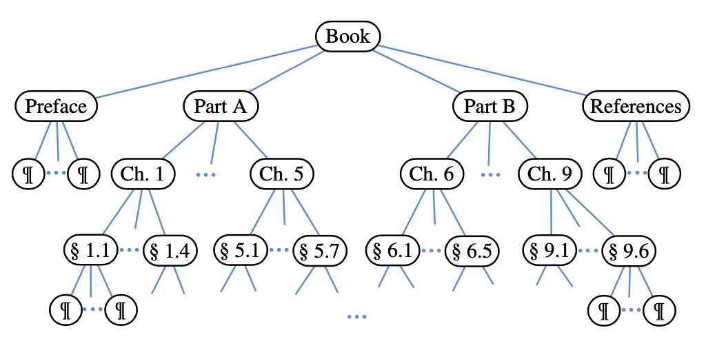
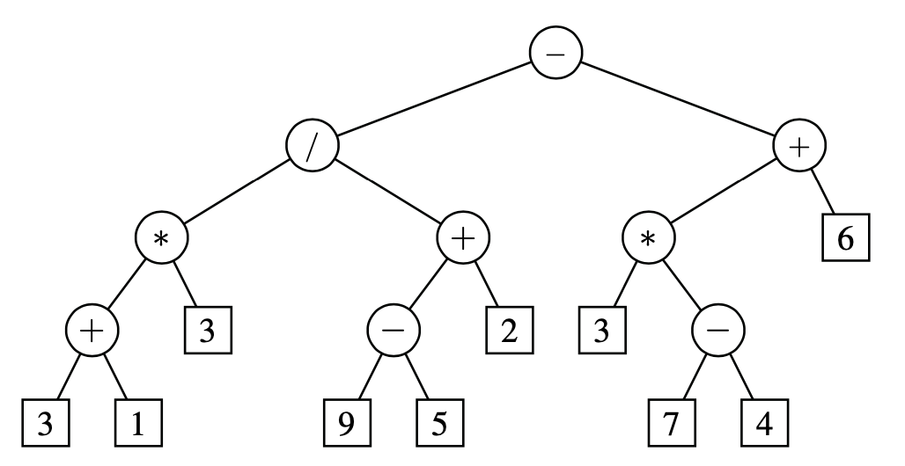
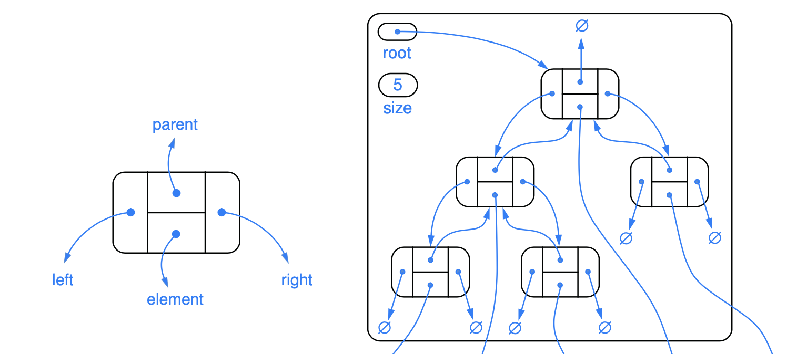
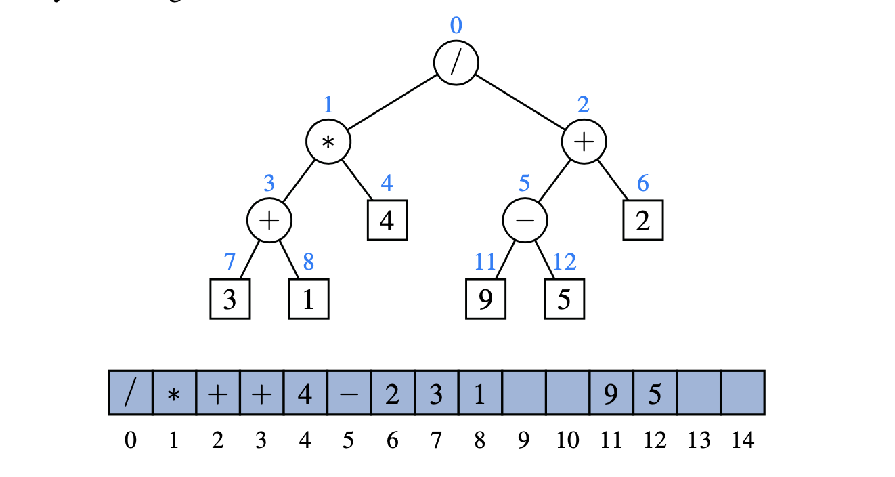
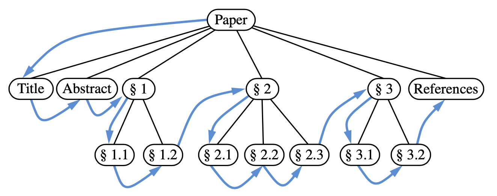
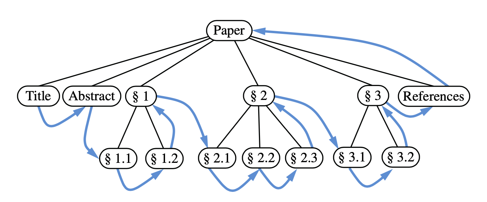

# Contents

- [Tree ADT](#tree-adt)
- [Ordered Trees](#ordered-trees)
- [Binary Tree](#binary-tree)
  - [Binary Tree ADT Implementation](#binary-tree-adt-implementation)
  - [Linked Binary Tree Implementation](#linked-binary-tree-implementation)
  - [Array Based Binary Tree Implementation](#array-based-binary-tree-implementation)
- [Tree Traversal Algorithms](#tree-traversal-algorithms)

# Tree ADT

A **tree** is an abstract data type that stores elements hierarchically. Except for the top element,
each element in a tree has a **parent** element and zero or more **children** elements. 
The top element called the **root** of the tree. 
Two nodes that are children of the same parent are siblings. 
A node _v_ is **external** if _v_ has no children. External nodes are also known as **leaves**.
A node _v_ is **internal** if it has one or more children.

An **edge** of tree T is a pair of nodes (u,v) such that u is the parent of v, or vice versa. 
A **path** of T is a sequence of nodes such that any two consecutive nodes in the sequence form an edge.

The **depth** of p (position) is the number of ancestors of p, other than p itself. The depth of the root of T is 0.
The depth of p is one plus the depth of the parent of p. The running time of depth(p) for 
position p is O(dp +1), where dp denotes the depth of p in the tree.

The **height** of a tree is equal to the maximum of the depths of its positions. The height of p is 
one more than the maximum of the heights of p’s children. The running time of depth(p) for the tree
is O(n).

## ADT implementation

| methods              | description                                                                              |
|----------------------|------------------------------------------------------------------------------------------|
| ```getElement()```   | Returns the element stored at this position.                                             |
| ```root()```         | Returns the position of the root of the tree (or null if empty).                         |
| ```parent(p)```      | Returns the position of the parent of position p (or null if p is the root).             |
| ```children(p)```    | Returns an iterable collection containing the children of position p (if any).           |
| ```numChildren(p)``` | Returns the number of children of position p.                                            |
| ```isInternal(p)```  | Returns true if position p has at least one child.                                       |
| ```isExternal(p)```  | Returns true if position p does not have any children.                                   |
| ```isRoot(p)```      | Returns true if position p is the root of the tree.                                      |
| ```size()```         | Returns the number of positions (and hence elements) that are contained in the tree.     |
| ```isEmpty()```      | Returns true if the tree does not contain any positions (and thus no elements).          |
| ```iterator()```     | Returns an iterator for all elements in the tree (so that the tree itself is Iterable).  |
| ```positions()```    | Returns an iterable collection of all positions of the tree.                             |


[Tree interface](../../src/main/java/am/studygarage/datastructures/tree/Tree.java)

[Abstract Base Tree](../../src/main/java/am/studygarage/datastructures/tree/AbstractTree.java)

# Ordered Trees

A tree is **ordered** if there is a meaningful linear order among the children of each node; that is,
we purposefully identify the children of a node as being the first, second, third, and so on. Such an
order is usually visualized by arranging siblings left to right, according to their order.



_The components of a structured document, such as a book, are hierarchically organized as a tree whose
internal nodes are parts, chapters, and sections, and whose leaves are paragraphs, tables, figures,
and so on. The root of the tree corresponds to the book itself. We could, in fact, consider expanding 
the tree further to show paragraphs consisting of sentences, sentences consisting of words, and words 
consisting of characters. Such a tree is an example of an ordered tree, because there is a well-defined 
order among the children of each node._

# Binary Tree

A **binary tree** is an ordered tree with the following properties:
- Every node has at most two children.
- Each child node is labeled as being either a **left child** or a **right child**.
- A left child precedes a right child in the order of children of a node.



_An arithmetic expression can be represented by a binary tree whose leaves are associated with 
variables or constants, and whose internal nodes are associated with one of the operators +, −, ∗, and /._

## Binary Tree ADT Implementation

As an abstract data type, a binary tree is a specialization of a tree that supports three additional 
accessor methods:

| methods          | description                                                                     |
|------------------|---------------------------------------------------------------------------------|
| ```left(p)```    | Returns the position of the left child of p (or null if p has no left child).   |
| ```right(p)```   | Returns the position of the right child of p (or null if p has no right child). |
| ```sibling(p)``` | Returns the position of the sibling of p (or null if p has no sibling).         |


[Binary Tree Interface](../../src/main/java/am/studygarage/datastructures/tree/BinaryTree.java)

[AbstractBinaryTree Base Class](../../src/main/java/am/studygarage/datastructures/tree/AbstractBinaryTree.java)

## Linked Binary Tree Implementation



A natural way to realize a binary tree _T_ is to use a **linked structure**, with a node
that maintains references to the element stored at a position p and to the nodes associated with the
children and parent of _p_.

Concrete implementation of a tree class support the most suitable behaviors for updating a tree.

| methods                   | description                                                                                                                                       |
|---------------------------|---------------------------------------------------------------------------------------------------------------------------------------------------|
| ```addRoot(e)```          | Creates a root for an empty tree, storing e as the element, and returns the <br/>position of that root; an error occurs if the tree is not empty. |
| ```addLeft(p, e)```       |                                                                                                                                                   |
| ```addRight(p, e)```      |                                                                                                                                                   |
| ```set(p, e) ```          |                                                                                                                                                   |
| ```attach(p, T1, T2)  ``` |                                                                                                                                                   |
| ```remove(p)```           |                                                                                                                                                   |

[Linked Binary Tree Implementation](../../src/main/java/am/studygarage/datastructures/tree/LinkedBinaryTree.java)

## Array Based Binary Tree Implementation



Array based binary tree _T_ is based on a way of numbering the positions of T. For every position _p_ of T,
let f ( p) be the integer defined as follows.
- If p is the root of T,then f(p)=0.
- If p is the left child of position q, then f(p) = 2f(q)+1. 
- If p is the right child of position q, then f(p) = 2f(q)+2.

# Tree Traversal Algorithms

A traversal of a tree T is a systematic way of accessing, or “visiting” all the positions of T.
The specific action associated with the “visit” of a position p depends on the application of this traversal.

## Preorder and Postorder Traversals of General Trees

### Preorder traversal



Pseudo code:

```
perform the “visit” action for position p // this happens before any recursion
for each child c in children(p) do
  preorder(c) // recursively traverse the subtree rooted at c
```

### Postorder traversal



Pseudo code:

```
for each child c in children(p) do
  preorder(c) // recursively traverse the subtree rooted at c
perform the “visit” action for position p // this happens after any recursion
```

## Breadth-First Tree Traversal

Visiting Tree level-by-level. The process is not recursive, since we are not traversing entire subtrees at once. 
We use a queue to produce a FIFO (i.e., first-in first-out) semantics for the order in which we visit nodes. 
The overall running time is O(n), due to the n calls to enqueue and n calls to dequeue.

```
Initialize queue Q to contain root() 
**while** Q not empty **do**
  p = Q.dequeue()
  perform the “visit” action 
  **for** position p for each child c in children(p) **do**
    Q.enqueue(c)
```

## Inorder Traversal

For many applications of binary trees an inorder traversal is the most natural order.